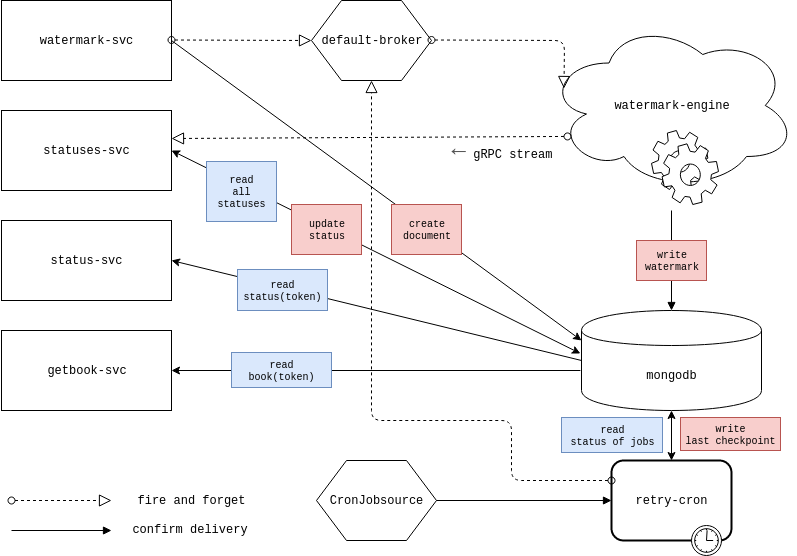

# Watermarking Microservices

This is a demo microservice architecture for watermarking documents asynchronously
using `Kubernetes` and `Knative` as its serverless framework.

## Diagram



## Architecture

Current configuration uses `knative` in-memory channels and as a result in-transit
documents could get lost before getting processed. To mitigate that, I added a
cron job that looks for recent jobs that might have been lost.

Alternatively you can store your events in a `Kafka` channel and remove the cron job,
however then you would need to run both `mongoDB` and manage a `Kafka` cluster.

`gRPC` is also unreliable in this architecture, and a better way would be to keep
status updates on channels as well, regardless our cron job makes sure stuck
jobs get finalized as well.

`statuses-svc` is also keeping a log of gRPC received status updates which makes it
a stateful service and in case there's a need to scale it, it's better to use a `redis` cache.

## How to run

Images of services have not been uploaded to a registry and as a result you need to
build them locally yourself. As `minikube` is widely used, I included a `docker-make`
script that automates this, so start a `minikube` instance with `knative 0.10`
(need `serving`, `eventing` and `istio-extras`) and run:

```
./minikube-docker-make-all
```  

Once all images are built, you need to create your `k8s` resources using:

```
./kube-apply-all
```

Above command creates a namespace called `watermark` and creates your resources there.
Once your pods are created you can find the `nodePort` of your services by running:

```
kubectl get services -n watermark
```

and access `GraphQL` playground by connecting to `MINIKUBE_IP:SVC_NODE_PORT` or:

```
# simply ask minikube for the url
minikube service watermark -n watermark --url
```
inside the `GraphQL` playground, you can add a document to be watermarked using:

```
mutation {
  watermark(document: {
    content: "journal"
    author: "someone"
    title: "daily writings"
    }) {
      ticket
    }
}
```

and you can view `status` of it by querying `status-svc` or `statuses-svc`:

```
# simply ask minikube for the url
minikube service statuses -n watermark --url
```

then

```
# logs from cache
query {
  logs {
    ticket
    status
  }
}

# from db
query {
  statuses {
    ticket
    status
  }
}
```

Keep in mind that `mongodb` has no volumes attached in current configuration, so
you'll lose data on pod restarts, unless you change `db/k8s.yaml`.

## Running tests

Make sure you have `npm install` every service and then test all services:

```
./npm-install-all # if you haven't already
./run-tests-all
```

## Removing

This can simply be achieved by removing the namespace or alternatively:

```
./delete-all
```
